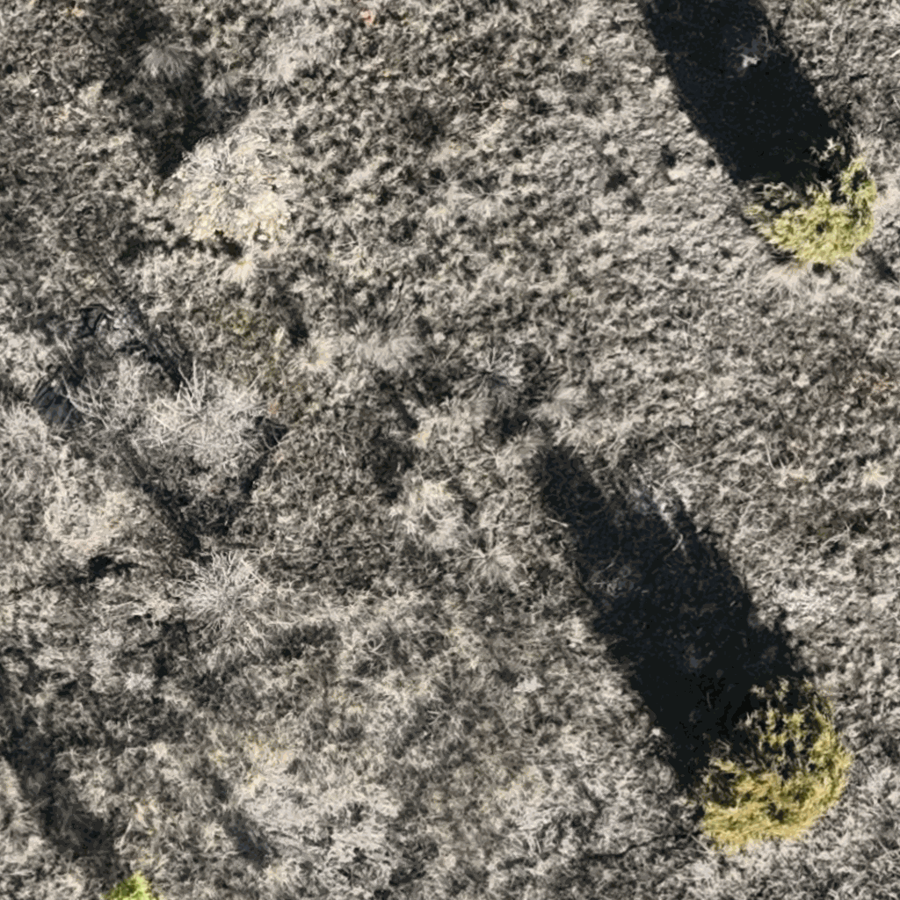

# Light Stable Representations Dataset

<div align="center">

</div>

## Project Goals

This project aims to develop vision encoders that maintain representational stability under varying lighting conditions by creating a specialized dataset from drone orthomosaics captured at three different times of day (10:00, 12:00, and 15:00) over the same geographic area at MPG Ranch, Montana, USA. By analyzing how vision model features change across these time points while the underlying scene representations remain constant, we can identify which features are most sensitive to illumination changes versus those that capture lighting-invariant representational information. The dataset enables researchers to train and evaluate computer vision models for improved robustness to natural lighting variations, ultimately advancing applications in remote sensing, environmental monitoring, and autonomous navigation where consistent scene understanding across different lighting conditions is critical.

## Dataset Structure

The dataset consists of 1024x1024 pixel tiles extracted from three orthomosaics, with each tile representing the same geographic location captured under different lighting conditions. The dataset is organized into three configurations on Hugging Face Hub, each serving different research needs.

All configurations share consistent 80/20 train/test splits with matching tile identifiers for cross-referencing.

### Configuration 1: `default`
Raw imagery and environmental data for direct analysis:
- **Images**: RGB tiles for three time points (10:00, 12:00, 15:00)
- **Canopy Height**: 1024×1024 integer grid (centimeter units) from canopy height model
- **Identifiers**: Location-based tile IDs for geographic referencing

### Configuration 2: `dinov2_base`
Pre-computed DINOv2 Base (ViT-B/14) embeddings:
- **Global Features**: CLS tokens (768-dim vectors) capturing scene-level representations
- **Spatial Features**: Patch tokens (256×768 arrays) from 16×16 spatial grid
- **Identifiers**: Matching tile IDs for cross-reference with other configs

### Configuration 3: `dinov3_sat`
Pre-computed DINOv3 Large (ViT-L/16) embeddings with satellite pretraining:
- **Global Features**: CLS tokens (1024-dim vectors) capturing scene-level representations
- **Spatial Features**: Patch tokens (196×1024 arrays) from 14×14 spatial grid
- **Identifiers**: Matching tile IDs for cross-reference with other configs

**Usage:**
```python
from datasets import load_dataset

# Load specific configurations
dataset_default = load_dataset("mpg-ranch/drone-lsr", "default")
dataset_dinov2 = load_dataset("mpg-ranch/drone-lsr", "dinov2_base")
dataset_dinov3 = load_dataset("mpg-ranch/drone-lsr", "dinov3_sat")
```

The data is available on Hugging Face Hub at [mpg-ranch/drone-lsr](https://huggingface.co/datasets/mpg-ranch/drone-lsr).

## Processing Pipeline

The dataset creation follows a rigorous preprocessing pipeline:

1. **00_tile_data.py**: Tiles orthomosaics and co-registers the canopy height model into 1024×1024 outputs with quality control
2. **01_exclude_temporal_anomalies.py**: Removes tiles with transient objects, ensuring both RGB and CHM rasters are excluded together
3. **02_push_docs_to_hf.py**: Uploads documentation and metadata to Hugging Face Hub
4. **03_push_imgs_hf.py**: Quantises canopy height to centimeters, extracts DINOv2 and DINOv3 embeddings, performs consistent 80/20 train/test splits, and uploads all three dataset configurations

This pipeline ensures high-quality, representationally consistent tiles suitable for training lighting-robust vision models.
