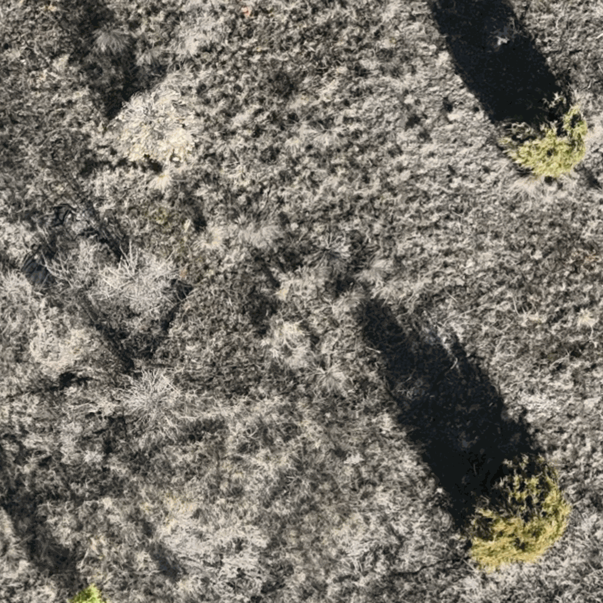

# Light Stable Semantics Dataset

## Project Goals

This project aims to develop vision encoders that maintain semantic stability under varying lighting conditions by creating a specialized dataset from drone orthomosaics captured at three different times of day (10:00, 12:00, and 15:00) over the same geographic area at MPG Ranch, Montana, USA. By analyzing how vision model features change across these time points while the underlying scene semantics remain constant, we can identify which features are most sensitive to illumination changes versus those that capture lighting-invariant semantic information. The dataset enables researchers to train and evaluate computer vision models for improved robustness to natural lighting variations, ultimately advancing applications in remote sensing, environmental monitoring, and autonomous navigation where consistent scene understanding across different lighting conditions is critical.

## Dataset Structure

The dataset consists of 1024x1024 pixel tiles extracted from three orthomosaics, with each tile representing the same geographic location captured under different lighting conditions. The data is available on Hugging Face Hub at [mpg-ranch/light-stable-semantics](https://huggingface.co/datasets/mpg-ranch/light-stable-semantics).

## Repository Contents

- `hf_preprocessing/`: Scripts for processing orthomosaics and uploading to Hugging Face
- `experiments/`: Analysis scripts including DINOv2 feature extraction
- `data/`: Local storage for processed tiles and features